<div align="center">


# ♡ angelOS ♡

**`~ welcome back, internet angel ~ ● LIVE`**

A desktop for **CachyOS / Arch** on **[niri](https://github.com/YaLTeR/niri)**, with its own shell written on
[Quickshell](https://quickshell.org): NEEDY GIRL OVERDOSE on the outside, Y2K on the inside, an angel in the corner,
and a story under the wrapping paper. Two looks. A game you can switch off. Wallpapers that breathe.

-ff5cad?style=flat-square&labelColor=241432)


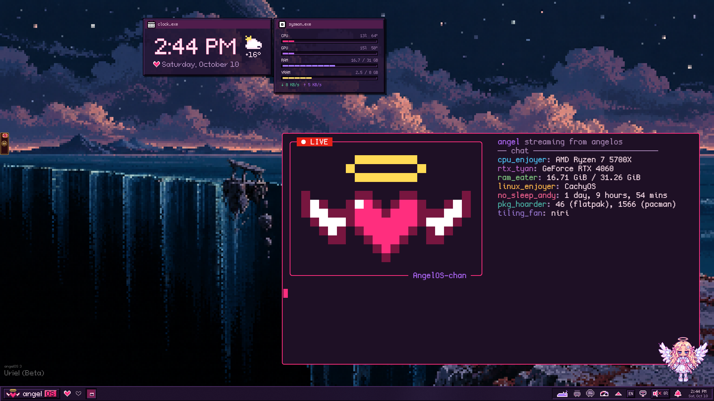

**English** · [Русский](README.ru.md)

</div>

> [!NOTE]
> Every picture here is a clean install in a nested niri session with a throw-away home: user `angel`, no
> notifications or chats of anyone's. In a nested session niri uses `Alt` as `Mod`; on real hardware `Mod` is the
> **Super / Windows** key (⌘ in the macOS look), and that is what the key tables say.

---

*What follows was in `~/Documents/diary.txt` on the machine the screenshots were taken on. Nobody remembers writing
it. It is kept as it was found, pictures added where the text pointed at something.*

**Entries:** [01 install](#-01--i-installed-it) · [02 two looks](#-02--it-has-two-faces) ·
[03 wallpapers](#-03--the-wallpaper-is-alive) · [04 right-click](#-04--i-right-clicked) ·
[05 settings](#-05--everything-is-a-setting) · [06 desktop](#-06--windows-on-a-strip) ·
[07 macOS](#-07--goldengateapp) · [08 the game](#-08--there-is-someone-in-the-corner) ·
[09 plugins](#-09--other-people-wrote-things-for-it) · [10 updates](#-10--it-looks-after-itself) ·
[11 hardware](#-11--it-runs-on-what-i-have) · [12 open](#-12--it-is-all-here) · [keys](#-the-back-pages-keys)

---

## ✧ 01 · i installed it

I found the address on a scrap of paper. Three lines. I typed them in on a Friday night.

<div align="center">
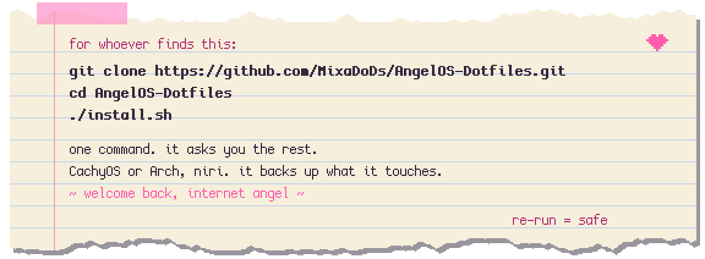
</div>

```bash
git clone https://github.com/MixaDoDs/AngelOS-Dotfiles.git
cd AngelOS-Dotfiles
./install.sh
```

It talked to me: a pastel stream in the terminal drawn with
[gum](https://github.com/charmbracelet/gum), pixel frames, menus I ticked with the space bar, a progress bar made of
hearts and a chat that commented on what was going on. It asked nine things and then went off on its own.

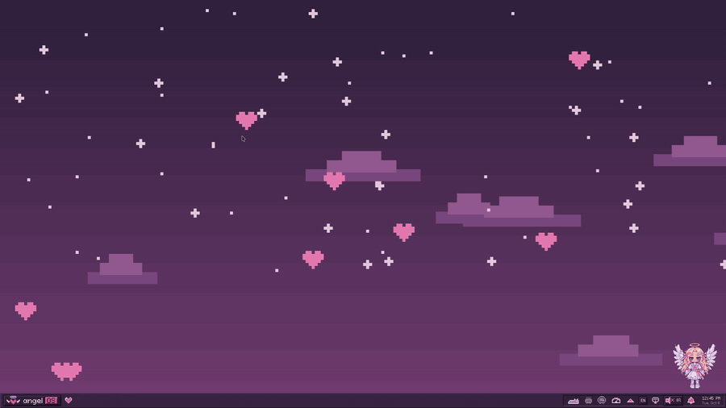

| It asked | What I said |
| --- | --- |
| Profile | `full` (the whole look) or `tech` (niri config and the helper tools only) |
| Shell | angelOS (default), Noctalia, or none |
| Look | **Pixel** or **macOS**, and with macOS whether I wanted the ⌘ keys |
| The game | angelOS as a game, or plain dotfiles (`ANGELOS_GAME=0\|1`) |
| Wallpapers | packs from [PixelStreetArt_Wallpapers](https://github.com/MixaDoDs/PixelStreetArt_Wallpapers), only the ticked folders |
| fish | install it with its look and make it the login shell (`FISH_DEFAULT=0` keeps yours) |
| Apps | the ones from the screenshots: Helium, Telegram, Spotify, Obsidian, qView, mpv, LocalSend, Discord |
| Extras | voice input (Voxtype + a Whisper model), the SDDM login screen, the everyday tools |
| Keyboard | my layouts, which one is on after login, the switch shortcut |

Everything it replaced it backed up first (`name.bak.YYYYMMDD-HHMMSS`), then it ran `niri validate` and told me what
to do next. Running it again is safe. Without a terminal, `INTERACTIVE=0` with the answers as environment variables
does the same thing in a script (`PROFILE`, `ANGELOS_THEME`, `MAC_KEYS`, `KB_LAYOUTS`, `INSTALL_APPS` and the rest are
listed at the top of `install.sh`).

Then the first login. The screen said it was finishing the install, and for a minute I believed it. I am not going
to write down what happened in that minute. Something came up from under the edge of the screen, and then a cute
little tune, and then a setup wizard as if nothing had happened: language, where I was coming from (Windows, a Mac,
another Linux, nothing), the game or just a desktop, which screen is the main one, layouts, mouse, light or dark, a
wallpaper, how much should move. Then pixel circles walked me around the screen and told me what each thing was.


*(`angelos setup skip` from a text console lets the desktop go at once if the wizard ever gets stuck. Both the wizard
and the tips can be replayed from Settings → Account.)*

---

## ✧ 02 · it has two faces

The installer asked **Pixel or macOS**. I picked pixel. The next day I tried the other one, because
*Settings → Appearance* switches at any time and everything a look changed outside the shell (GTK, Qt, the cursor,
niri's keys) comes back when you leave it.

| | **Pixel** (angelOS) | **macOS** (Golden Gate) |
| --- | --- | --- |
| Panel | a Win98 taskbar: pixel-heart workspaces, window buttons, the **current lyric line** in the middle | a menu bar: the app's own menus, Control Center, Spotlight, the date |
| Apps | Start menu + launcher | a **Dock** with magnification, minimized windows, Downloads and Trash |
| Windows | pixel frames, 4 px corners, a thin accent outline | 16 px corners, shadows, traffic lights, **minimize to the Dock** |
| Glass | — | **Liquid Glass**: niri's blur under the shell, a lens edge drawn by a shader |
| Sounds | the Y2K pack | Mac-like system sounds (its own, CC0) |
| Keys | angelOS's (`Mod`+`Space`, `Mod`+`Q`…) | optional **⌘ keys**: ⌘Q ⌘W ⌘M ⌘Space ⌘Tab, tiling on `Super`+`Alt` |
| Font, cursor | pixel fonts, pixel cursors | Inter, the `macOS` cursor |

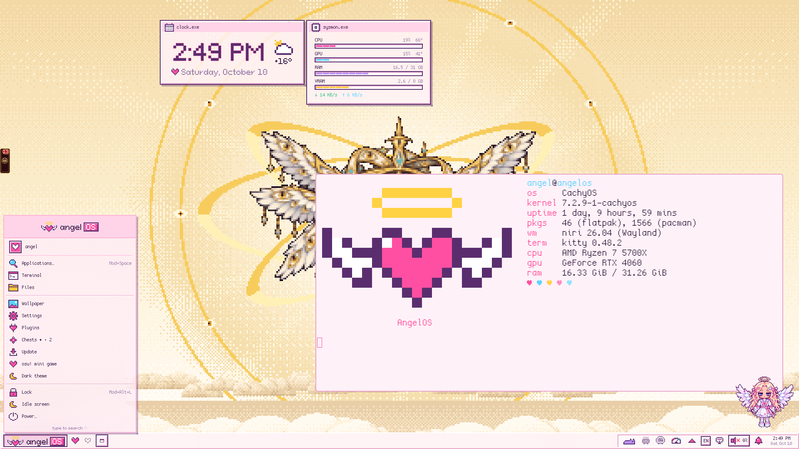 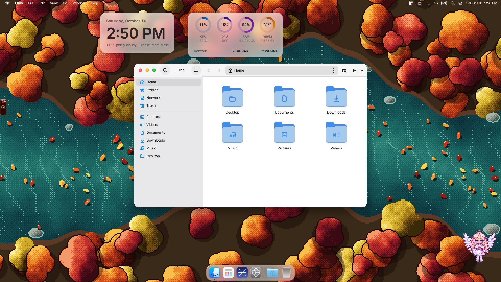

*pixel.exe ✧ goldengate.app: one click apart.*

The pixel one is the one that sings. The bar shows the current line of whatever is playing (synced lyrics from
[lrclib.net](https://lrclib.net) over MPRIS), typed out like on a stream, the old line sliding up. Palettes:
`bubblegum`, `overdose`, `cyber angel`, Gruvbox, Rosé Pine, Catppuccin, or colours pulled out of the wallpaper.

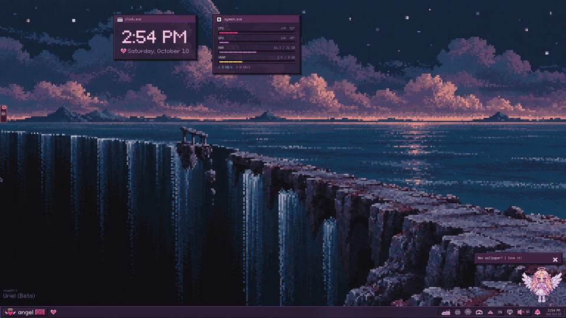

---

## ✧ 03 · the wallpaper is alive

The picture stays a picture; the shell looks at it, finds the sky, the water, the clouds, the thing hanging
in the sky, and moves only those: stars twinkle and fall at night, the water ripples and reflects, clouds drift,
now and then a glint runs along the ring or a pebble falls off the cliff. It goes still under a full-screen window
and costs almost nothing. *Settings → Wallpaper → Alive* turns the layers on and off one by one.

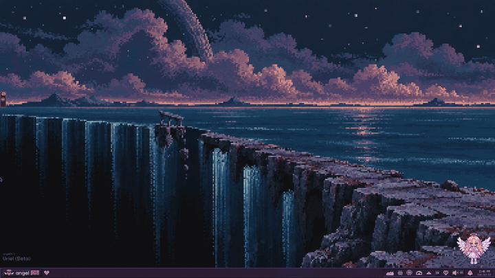

A picture can carry a hint next to it (`picture.scene.json`: which part is sky, which is water, where the ring is)
and the release wallpapers ship with theirs. Pictures without a hint get the automatic look.

Every release comes with its own wallpapers, drawn for it, MIT like the rest, each in a day and a night version. The
shell picks day or night to match the theme, and the shape to match the monitor: 16:9, 21:9, or 9:16 when the screen
is turned on its side. The installer puts them all in `~/Pictures/AngelOS/`.

<div align="center">
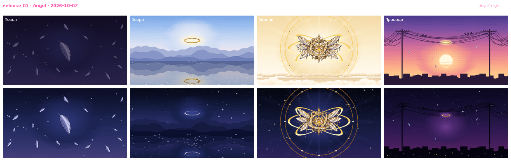
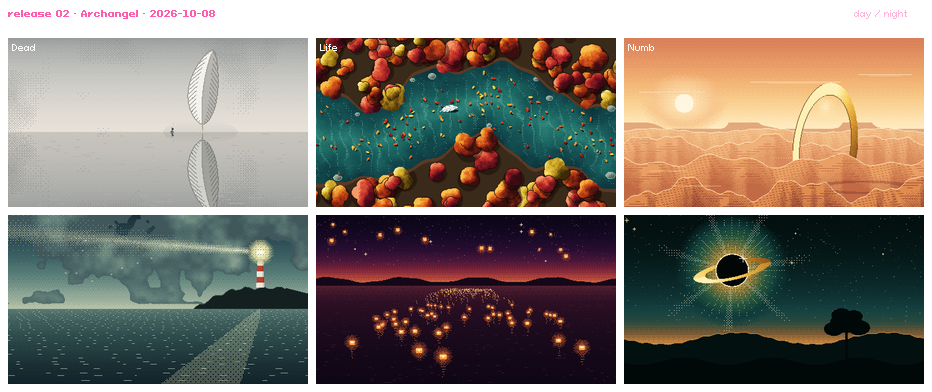
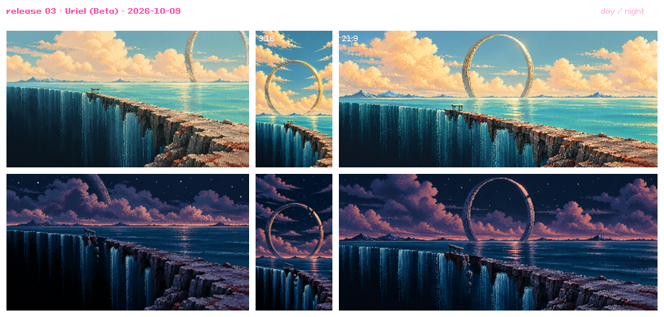
</div>

Changing the wallpaper plays a pixel transition (mosaic + Bayer dither), only when the picture changes, so switching
workspaces stays instant even with a wallpaper per workspace. `Mod`+`Shift`+`Return` opens the picker: one picture
for every screen, one per monitor, or one per workspace.

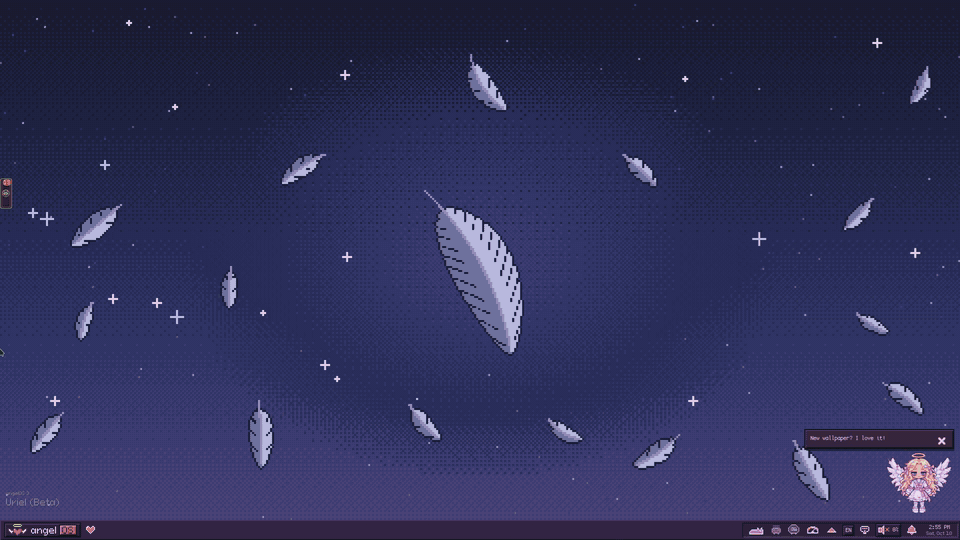

---

## ✧ 04 · i right-clicked

The desktop has a menu. It has **six** menus, really, and you pick which one you get: the usual Windows 11 list, a
ring around the pointer, a glossy Y2K bubble, Control Center tiles, wings, a harp. (There is a seventh. It is not
on this floor.)


Whatever it looks like, it holds the same things: quick actions on top, **View ▸** (widgets, edit mode, snap to
grid), **New ▸** (note, screenshot, recording), **Open ▸** (your folders), display settings, personalisation, *Open
in Terminal*, and **Show more options ▸** for whatever the plugins add. What is in it, in what order, and your own
items: *Settings → Right-click menu*.

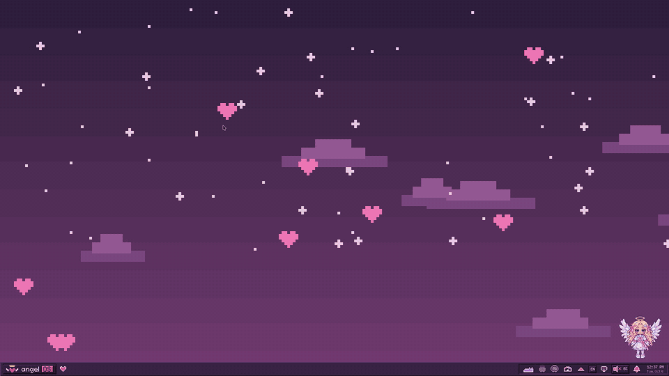

The widgets (`clock.exe`, `sysmon.exe` with CPU/GPU/RAM/VRAM/net, `cava.exe`, `music.exe`, and the plugins' own)
sit on the wallpaper, dragged by their title bar; double-click a title for edit mode. A pixel window, a plate, or
nothing around them, your choice.

---

## ✧ 05 · everything is a setting

I kept finding more. Writing them down so I stop being surprised:

- **The bar** has six shapes (a taskbar, a top bar, an island, a dock, capsules, "windose") and sits on any edge of
  the screen. Its layout is drag-and-drop.
- **The Settings app** itself has four faces: Windows 11, a macOS sidebar, a Win98 Control Panel, Properties tabs
  (`angelos settingsView …`). It has search with synonyms and a history.
- **Alt+Tab** in three styles (angelOS, NGO, Y2K) or niri's own with live previews.
- **Workspace switching** in thirteen animations: soft, dash, spring, snap, zoom, card, wipe, fade, dissolve, glitch,
  CRT, realm, instant. The NGO popup `workspace_N.exe` and the strip of hearts come with it.
- **The login screen** (SDDM) in five looks, with a live preview and the same wallpaper as the desktop. The
  **lock screen** in two: an NGO stream with a chat, or heaven's gate.
- **fastfetch** in seven styles (compact, angel, helper, receipt, stream, window, mini), with a sigil for each.
- **Fonts** by preset, pixel or not. **Cursors** pixel or `macOS`. **Sounds** in packs (Y2K, Overdose, macOS), on
  every event or none, under your music.
- **Windows:** width presets, a width per app, where new ones open, the cobweb that grows on a window you have not
  touched for hours.
- **Display:** drag the screens around; the exact refresh rates niri lists, rotation, scale, saved so they survive
  a reboot.
- Every change to niri's config is backed up, checked with `niri validate` and rolled back if niri says no. Browsers
  follow the theme too (Helium and Chromium through GTK, Firefox through `userChrome.css`).

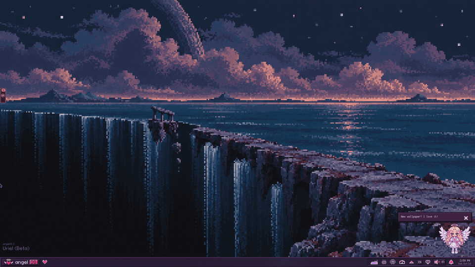


---

## ✧ 06 · windows on a strip

niri. Windows live in columns on an infinite horizontal strip: new ones open to the right, focus scrolls the view,
columns can be resized, centred, stacked, turned into tabs or popped out as floating windows. `Mod`+`Tab` zooms out
to every workspace at once. I thought I would hate it. I do not.


`Mod`+`Space` is the launcher: fuzzy app search that learns what I open, `web …` for the web and my sites,
`plugins …` for the catalog, `claude …` for Claude Code, `> command` for anything in `sh`.

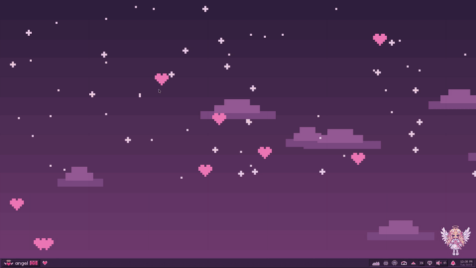

Forgot a key? `Mod`+`Shift`+`Esc` shows niri's overlay; every bind has a readable name.


The terminal came dressed too: **fish** with the pure prompt, fastfetch with the angelOS logo as the greeting, eza,
fzf, done, autopair (on CachyOS this is `cachyos-fish-config`; on Arch the same comes from `packages/fish.txt` and
fisher). **kitty**, **foot** and **Alacritty** wear the palette, so do **btop** and **fastfetch**. **Neovim** with
[LazyVim](https://lazyvim.github.io) goes in only where `~/.config/nvim` is empty; your own config is never touched.
`n` opens it; `angelos …` is on the `PATH`.

Small tools in `~/.local/bin`, plain Bash and Python: `niri-screenshot-region` (a region, with pixel "gravity ropes"),
`niri-record-region` (toggle a recording to `~/Videos`), `niri-ocr` (a region's text to the clipboard, every
installed Tesseract language), `niri-cast-privacy` (chats and password managers go black on a stream),
`niri-game-mode` (no animations, blur or glass while a game covers a screen), `polkit-agent-guard` (a password
dialog always comes), `voxtype-indicator` (dictation).

---

## ✧ 07 · goldengate.app

The other face. The whole desktop like macOS 27 *Golden Gate*, drawn from screenshots and Apple's guidelines, not
from memory, and without a single file of Apple's. Pick it in the installer, in the wizard (*"Coming from a
Mac?"*), in Settings → Appearance, or with `angelos settingsSkin goldengate`.

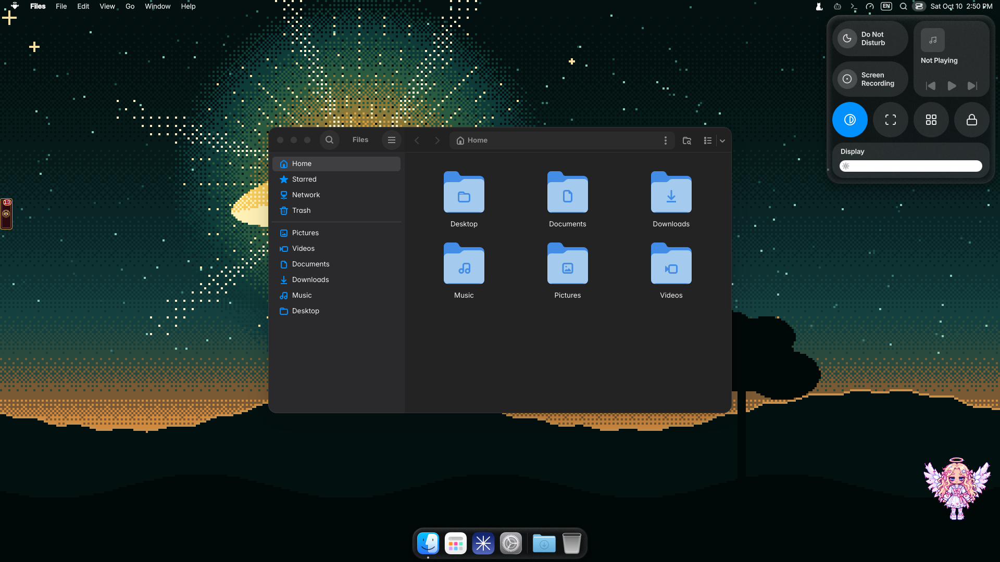

- **The menu bar.** 24 pt on top of every screen. On the left the angelOS emblem (About, Settings, Force Quit, Sleep,
  Restart, Shut Down, Lock, Log Out), the app's name in bold and **its own menus**: Qt apps over dbusmenu, GTK 3
  through `appmenu-gtk-module`, GtkApplication actions, and a standard set built from the app's own shortcuts for the
  rest. Nothing dead in the menus. On the right: sound, layout, Wi-Fi and Bluetooth when there are any, the tray,
  Spotlight, **Control Center** and the date. `Ctrl`+`F2` walks the menus from the keyboard.
- **The Dock.** A Liquid Glass slab: pinned apps, *Applications*, recent ones after a divider, **minimized windows**,
  Downloads and the Trash. A dot under running apps, a right-click menu with the app's windows and `.desktop` actions,
  **magnification** like on a Mac (the icon under the pointer grows, its neighbours follow a cosine, the Dock widens
  both ways so the icon stays under your pointer), auto-hide. Icons from
  [MacTahoe](https://github.com/vinceliuice/MacTahoe-icon-theme) (GPL-3.0, pinned release, sha256-checked).
- **Minimize.** niri has no minimizing; it throws the request away. angelOS does it: the window goes to a hidden
  workspace and a **snapshot of it lands on the right of the Dock**. The yellow light, *Window → Minimize*, `⌘M`, or
  `angelos macMinimize`; back with a click on the snapshot, on the icon, in Alt+Tab or in the overview.
- **Spotlight** (`⌘Space`): a dark glass capsule for apps, files, actions and the clipboard. **Control Center** has the
  macOS layout: Wi-Fi, Bluetooth, *Now Playing*, Screen Recording, Mission Control, Lock, Dark Mode, Screenshot, Do
  Not Disturb, the Display and Sound sliders. The date opens the **Notification Center**.
- **Liquid Glass** is three layers: niri 26.04's blur and saturation under the glass (windows included), a tint from
  clear to tinted, and a lens edge (a dark rim, a highlight stronger towards the light, a thin band of gathered light
  with a touch of colour split) drawn by [`shaders/liquid_glass.frag`](.config/quickshell/angelos/shaders/liquid_glass.frag).
  *Reduce transparency* makes it solid.
- **Sounds:** notification, error, the volume pop, the shutter, emptying the Trash, USB in and out, charger, lock,
  log-in. All its own, synthesised by `scripts/mac-sounds.py`, CC0. Drop files with the same names into
  `~/.local/share/angelos/sounds/macos/` to bring your own.

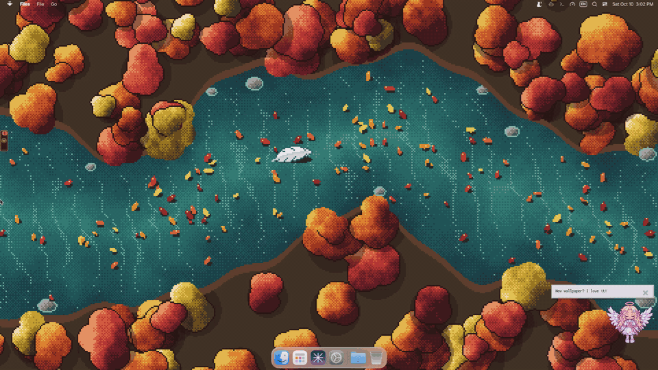


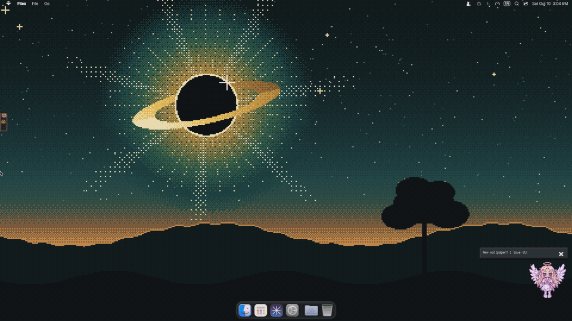

**What is not Apple's:** the repository holds no file of Apple's. An angelOS emblem instead of the apple, **Inter**
(SIL OFL) instead of SF Pro, Lucide icons, MacTahoe Dock icons (GPL-3.0), the `macOS` cursor from
[ful1e5/apple_cursor](https://github.com/ful1e5/apple_cursor) (GPL-3.0), synthesised sounds, drawn wallpapers.
MacTahoe, Inter and the cursor are downloaded when the look is first turned on, under their own licenses.

---

## ✧ 08 · there is someone in the corner

She was there from the first login, bottom right, sitting on the bar. She talks. Not often, and not about nothing.
She noticed when I opened six windows in a row. She noticed when I had been at the screen for four hours. There are
achievements, and chests, and a diary of hers with a key I had to earn, and she minds very much if I read it while she
is around.

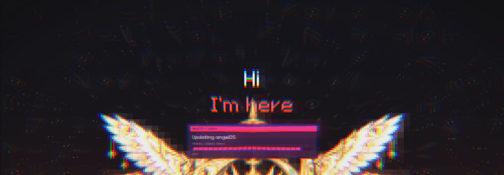

The sounds are Y2K: a disc spinning up at boot, a chime, Undertale-style voices for her lines. The lock screen can be
an NGO stream with a chat that answers you. There is a mode for streamers where she sits in the frame and reads the
chat. Everything that flashes, shakes or gets loud has a *calm* switch.

What I know for sure, because I read the code: **it may scare you, but it never harms.** It does not touch your
files, sends nothing anywhere, never reads your windows, browser or chats. The lock screen, the power menu, volume,
notifications and polkit always work, whatever is going on. And there is a lower floor to this place that I am not
going to describe, except that the Dock and the menu bar know about it too.

- **Out at once, any time:** `angelos game off`, or **`Mod`+`Ctrl`+`Shift`+`Esc`**. angelOS stays as plain dotfiles,
  the angel is gone, the right-click menu loses its seventh look. `angelos game on` brings it all back. The installer
  and the wizard ask first.
- **Motion:** `angelos motion full|calm|off`. *Calm* is no flashes, no shaking, no sudden loud sounds. *Off* is no
  animations at all.
- **Progress** lives in `~/.config/angelos/save.json`. Updates never touch it.

---

## ✧ 09 · other people wrote things for it

A plugin is a folder with a `manifest.json`. It can add right-click items, bar and desktop widgets, launcher
providers, a settings page and a background service. The guide is
[`docs/PLUGINS.md`](.config/quickshell/angelos/docs/PLUGINS.md).

- **Community Plugins:** one catalog in *Settings → Plugins* (and `plugins …` in the launcher): the approved entries of
  the [angelOS community registry](https://github.com/futureUnd1ground/angelos-community-registry) next to what you
  have, with install, update and **roll back**. Updates are checked once a day; before each one the installed copy
  becomes a snapshot, and a plugin that does not load goes back to it by itself.
- **Plugin Studio:** with *Developer mode* on, describe a plugin, answer its questions, and Studio writes themed QML
  with your own OpenAI or Anthropic key, shows the files and checks them before you install
  ([guide](.config/quickshell/angelos/docs/PLUGIN_STUDIO.md)).

| Built in | What it does |
| --- | --- |
| `cat` | A pixel cat on the bar: asleep, walking, or running with the CPU load |
| `speedtest` | An internet speed test with a pixel speedometer and a history |
| `web-search` | `web …` in the launcher: search engines and favourite sites |
| `claude-companion` | What is left of your Claude plan, live Claude Code sessions, `claude …` in the launcher |
| `codex-companion` | The same for OpenAI Codex: 5-hour and weekly windows, today's tokens, live sessions |
| `osu-mini` | An osu!-style mini game on the beat: pixel hearts, combos, ranks (`osu` in the launcher) |
| `nightlight` | A warm screen in the evening through `wlsunset` |
| `stream-stats` | NGO-style `stats.exe`: stress = CPU, darkness = RAM, love = uptime |
| `quick-actions` | Extra right-click items |


---

## ✧ 10 · it looks after itself

**Updates.** *Settings → Updates* checks the repository I installed from, shows what is new and, on a click, runs
`git pull` and the installer without packages. Before anything changes, every file the installer may write is copied
to `~/.local/state/angelos/backups/<date>-update/`. An update counts only when the installer, the niri wiring and
`niri validate` all pass; otherwise the page offers **Restore the state before the update**. A running angelOS asks
whether to restart now or later; windows stay open. From a terminal: `git pull && ./install.sh`.

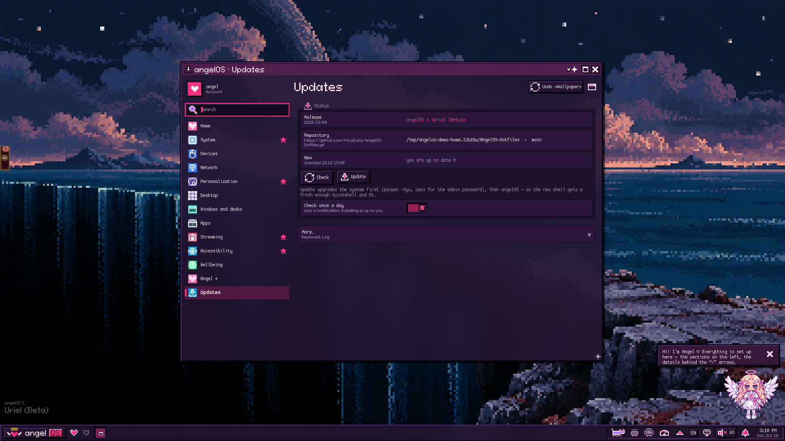

The author's setup is the base and mine goes on top. A config I never changed follows the author on every update;
one I changed gets the author's changes merged in, and where we both changed the same lines mine stay (the old file
next to it as `*.bak.<date>`). Shortcuts merge key by key. Files angelOS generates stay mine, their new versions
parked in `~/.local/state/angelos/kept-updates/`. My own lines go in `~/.config/fish/user.fish` and
`~/.config/niri/cfg/user.kdl`, read last, never touched. After an update it offers the apps the author added to the
groups I took, and never installs or removes anything by itself.

**Reports.** When something breaks, *Settings → About → Report a problem* (or `angelos report`) packs one archive:
versions (angelOS, Quickshell, Qt, niri, kernel, GPU), the shell's service state and restarts, what it costs, the
log, the last crash reports, the niri config check, plugins and settings, with the personal bits taken out (the home
path and user name become `~` and `<user>`; launcher history, workspace names and free texts are left out). Nothing
is sent anywhere. The archive lands in `~/` with a link to a new issue, and I decide what to attach.

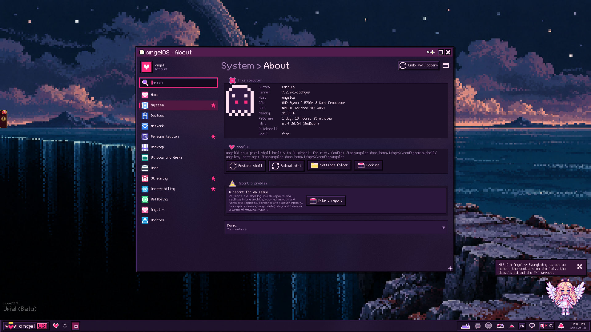

A watchdog restarts the shell if it stops answering for fifteen seconds, and keeps the crash report. The login
screen keeps a backup of the previous theme. The installer never overwrites `monitor.kdl`.

---

## ✧ 11 · it runs on what i have

- **CachyOS or Arch Linux.** The installer appends only the `[cachyos]` repository where it is missing; Arch's own
  packages win. Steam's driver prompt no longer drags in anything exotic.
- **GPUs:** NVIDIA and AMD. The system monitor reads both. The Qt fixes for NVIDIA are in.
- **Laptops:** battery and charge limit, eco mode, brightness and keyboard-light keys, touchpad direction and
  acceleration, all in the wizard and in Settings, and only shown on a laptop.
- **Monitors:** any number, any refresh rate (the exact one niri lists, saved so 144 Hz stays 144 Hz after a reboot),
  scale, rotation, portrait screens with 9:16 wallpapers, ultrawides with 21:9 ones. Named by *Make Model Serial*,
  so a renamed connector still matches.
- **Keyboards:** any layouts, the switch shortcut you choose, and they also pick the dictation language and the OCR
  packs. ⌘ keys for people from a Mac, GTK window buttons for people from Windows.
- **Languages:** English and Russian, in the installer, the wizard, the shell and the angel.
- **Browsers:** Helium, Firefox, Chromium, Brave, Zen, LibreWolf, Vivaldi or Chrome; the wizard asks, `Mod`+`B`
  opens the default one.
- **Accessibility:** UI size, motion, contrast, a lens (`Mod`+`Alt`+`=`), voice dictation, a shake-to-find-the-cursor.
  **Wellbeing:** screen time, breaks, water; she does the reminding.
- **Game controllers:** the shell knows yours, its buttons and axes.
- **Streaming:** an OBS-aware stream mode, `niri-cast-privacy` for chats and password managers, a game mode that
  drops effects while a game covers the screen.

---

## ✧ 12 · it is all here

MIT, all of it: the dotfiles, the shell, the wallpapers, see [`LICENSE`](LICENSE), © 2026 MixaDoDs. Parts made by
others keep their own licenses, listed in [`THIRD-PARTY.md`](THIRD-PARTY.md). No credentials, API keys, tokens,
browser profiles, cookies, history, caches, keyrings or runtime state are in the repository, and `scripts/check.sh`
fails if one ever slips in. Your angelOS settings (`~/.config/angelos`) are yours.

```text
.config/quickshell/angelos/  angelOS: the shell, both looks, plugins, templates, docs
.config/niri/                niri: config, key profiles (common / pixel / macos), rules, animations
.config/                     fish, kitty, foot, Alacritty, GTK, btop, fastfetch, Neovim, Noctalia, Voxtype
.local/bin/                  helper tools
.local/share/                the pixora icon theme and pixel fonts
Pictures/AngelOS/            every release's wallpapers, with their scene hints
packages/                    pacman.txt, angelos.txt, sddm.txt, tools.txt, fish.txt, nvim.txt (the apps: data/apps-catalog.json)
installer/tui.sh             the installer's face: gum menus, pixel frames, hearts, the stream chat
install.sh                   the installer: asks everything, backs up, Arch Linux / CachyOS only
scripts/check.sh             the repository check, with end-to-end installer tests
scripts/demo/                the stand the pictures on this page were shot in
docs/                        the screenshots and GIFs of this page
```

`scripts/check.sh` runs the whole check locally (the same one GitHub runs, in an `archlinux` container with
`scripts/ci-local.sh`). Issues and pull requests are welcome; `angelos report` makes a good first attachment.

---

## ✧ the back pages: keys

Each look has its own key profile: [`keybinds.kdl`](.config/niri/cfg/keybinds.kdl) only picks one,
[`keybinds-common.kdl`](.config/niri/cfg/keybinds-common.kdl) (both looks) plus
[`keybinds-pixel.kdl`](.config/niri/cfg/keybinds-pixel.kdl) or [`keybinds-macos.kdl`](.config/niri/cfg/keybinds-macos.kdl).
Settings → Keyboard edits the one in front.

<details>
<summary><b>Both looks</b></summary>

| Keys | Action |
| --- | --- |
| `Mod`+`T` | Terminal (kitty) |
| `Mod`+`B` | Default browser |
| `Mod`+`E` | Files (Nautilus) |
| `Mod`+`V` | Clipboard history |
| `Mod`+`S` / `Mod`+`Alt`+`S` | Settings |
| `Mod`+`Shift`+`Return` | Wallpaper picker |
| `Mod`+`Shift`+`Q` | Power menu |
| `Mod`+`Alt`+`T` / `Mod`+`Alt`+`Y` | Light ⇄ dark / lyrics on-off |
| `Mod`+`Shift`+`S` | Screenshot a region ("gravity ropes") |
| `Mod`+`Shift`+`R` | Record a region (toggle) |
| `Mod`+`Shift`+`V` | Voice dictation (toggle) |
| `Mod`+`Shift`+`X` | Screencast privacy: chats and password managers go black on the stream |
| `Ctrl`+`Shift`+`2` / `3` | Screenshot the screen / the window |
| `Mod`+`Shift`+`←→↑↓` | Focus another monitor (`+Ctrl`: move the column there) |
| `Mod`+`Shift`+`P` | Monitors off |
| `Alt`+`Tab` | angelOS's window switcher |
| `Mod`+`Alt`+`=` / `-` / `0` | Lens: zoom in / out / close |
| `Mod`+`Esc` | Release a fullscreen app's keyboard grab |
| `Mod`+`Ctrl`+`Shift`+`Esc` | Out of the game at once |
| `Ctrl`+`Alt`+`Delete` | Quit niri |

Media and volume keys go to `angelos …` (a small OSD shows the level) and keep working on the lock screen.

</details>

<details>
<summary><b>Pixel</b></summary>

| Keys | Action |
| --- | --- |
| `Mod`+`Space` | Launcher |
| `Mod`+`Q` | Close window |
| `Mod`+`Alt`+`L` | Lock screen |
| `Mod`+`H` / `Mod`+`L` (or arrows) | Focus column left / right (`+Ctrl`: move it) |
| `Mod`+`J` / `Mod`+`K` | Focus window down / up |
| `Mod`+`1`…`9` / `Mod`+`Ctrl`+`1`…`9` | Go to workspace / move the column there |
| `Mod`+`O` | Previous workspace |
| `Mod`+`Tab` | Overview |
| `Mod`+`R` / `Mod`+`Alt`+`R` | Next / previous column width |
| `Mod`+`C` | Centre column |
| `Mod`+`[` / `Mod`+`]` | Pull a window into the neighbouring column, or push it out |
| `Mod`+`W` | Tabbed column |
| `Mod`+`Shift`+`Space` | Floating ⇄ tiled |
| `Mod`+`F` / `Mod`+`Shift`+`F` / `Mod`+`M` | Fullscreen / maximise column / maximise to the edges |
| `Mod`+`-` / `Mod`+`=` | Column narrower / wider |
| `Mod`+`Shift`+`T` | OCR a region to the clipboard |

</details>

<details>
<summary><b>macOS (⌘ = Super)</b></summary>

The ⌘ keys are optional: the installer asks (`MAC_KEYS=1|0`), and *Settings → Appearance → Golden Gate*
turns them on or off. Without them the macOS look keeps the pixel keys.

| Keys | Action |
| --- | --- |
| `⌘Space` | Spotlight |
| `⌘Q` | Quit the app in front (its own *Quit*, else all its windows) |
| `⌘W` | Close window |
| `⌘M` | Minimize to the Dock |
| `⌘H` | Hide the app |
| `⌘Tab` / `⌘⇧Tab` | Switch apps |
| `` ⌘` `` | Next window of the same app |
| `⌘,` | System Settings |
| `⌘⇧3` / `⌘⇧4` / `⌘⇧5` | Screenshot: screen / area / the screenshot menu |
| `⌃⌘F` | Fullscreen |
| `⌃⌘Q` | Lock screen |
| `⌥⌘Esc` | Force Quit |
| `⌃←` / `⌃→` | Workspace left / right |
| `⌃↑`, `F3` | Mission Control (overview) |
| `⌃F2` | The menu bar from the keyboard |
| `⌘⌥Space` | angelOS's launcher |
| `⌘⌥` + `H J K L` / arrows, `1`…`9`, `R`, `C`, `F`, `W` | Tiling: the pixel keys, one `Alt` further |

Inside apps, their own shortcuts stay theirs (`Ctrl`+`C`, `Ctrl`+`V`), and the menus label them that way.

</details>

<details>
<summary><b>The login screen (SDDM), when it misbehaves</b></summary>

| Symptom | Fix |
| --- | --- |
| Boots to a text console | `sudo systemctl enable --force sddm && sudo systemctl set-default graphical.target` |
| `display-manager.service already exists` | disable the other one (`gdm`, `lightdm`, `ly@tty2`, `greetd`), then enable SDDM |
| Plain SDDM instead of the angelOS theme | `grep -r Current= /etc/sddm.conf /etc/sddm.conf.d/`; install `qt6-declarative` |
| Missing wallpaper | set a wallpaper in angelOS and check `/usr/share/sddm/themes/angelos/walls/` |

Preview the theme without logging out: `sddm-greeter-qt6 --test-mode --theme /usr/share/sddm/themes/angelos`.

</details>

---

<div align="center">

*last entry. she says hi.*

`♡ thank you for watching the stream ♡`

</div>
