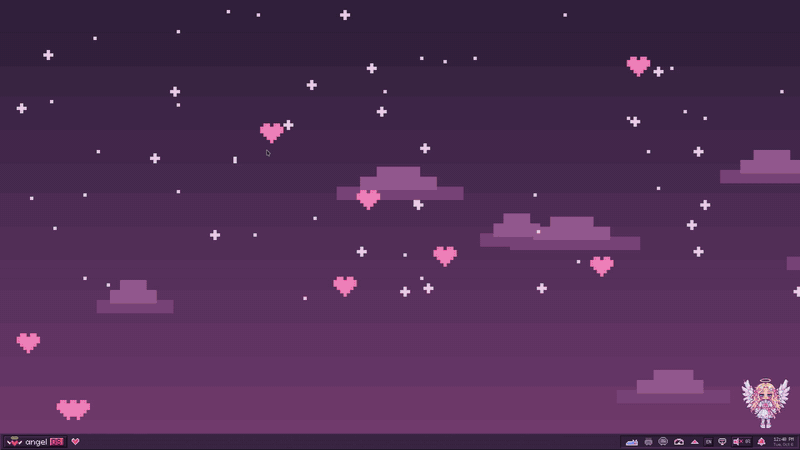
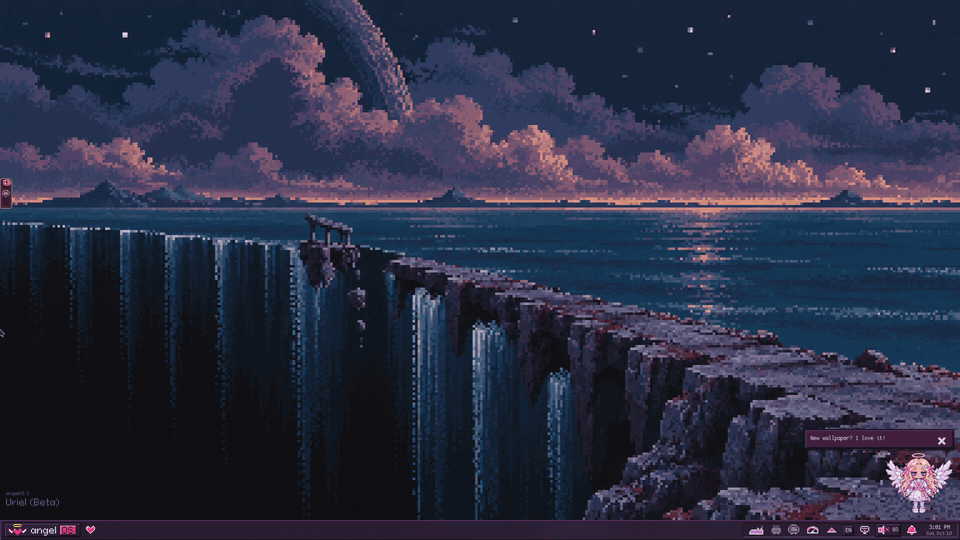
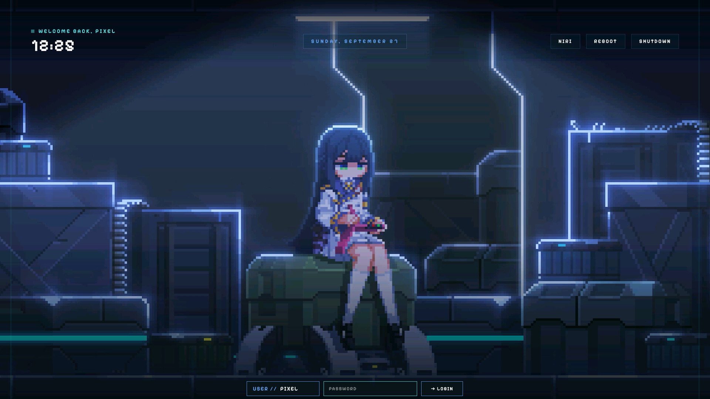

# PixelStreetArt Niri Dotfiles

A dark, pixel-flavoured **CachyOS + [Niri](https://github.com/YaLTeR/niri) + [Noctalia](https://docs.noctalia.dev/)** desktop: scrollable tiling, a glassy shell, a pixel font and icon theme, and a handful of small Wayland helpers for screenshots, screen recording, OCR, screencast privacy and voice input.


> The screenshot is from the working session. It was reviewed before publishing and contains no browser profiles, chats, credentials, or personal files.

**Jump to:** [In action](#in-action) · [Keybindings](#keybindings) · [Helper tools](#helper-tools) · [Install](#installation) · [Login screen](#login-screen-sddm) · [Keyboard layouts](#keyboard-layouts) · [Mouse and monitors](#mouse-and-monitors) · [Layout](#repository-layout)

---

## In action

Everything below was recorded from a **nested, throw-away Niri session that runs this repository's config with a clean `$HOME`**, so what you see is exactly what the installer gives you.

> [!NOTE]
> In a nested session Niri uses `Alt` as its `Mod` key. On real hardware `Mod` is the **Super / Windows** key, and that is what the tables below use.

### Scrollable tiling

Windows live in columns on an infinite horizontal strip. New windows open to the right, focus scrolls the view, and columns can be resized, centred, stacked, turned into tabs, or popped out as floating windows.



| Keys | Action |
| --- | --- |
| `Mod`+`H` / `Mod`+`L` (or arrows) | Focus column left / right |
| `Mod`+`Ctrl`+`H` / `L` | Move column left / right |
| `Mod`+`R` | Cycle preset column widths |
| `Mod`+`C` | Centre column |
| `Mod`+`[` / `Mod`+`]` | Pull a window into the neighbouring column, or push it out |
| `Mod`+`W` | Toggle tabbed column |
| `Mod`+`Shift`+`Space` | Toggle floating |
| `Mod`+`F` / `Mod`+`Shift`+`F` | Fullscreen / maximise column |

### Overview and workspaces

`Mod`+`Tab` zooms out to every workspace at once. Workspaces are dynamic and vertical, so you can send a column to the next one and jump straight back.



| Keys | Action |
| --- | --- |
| `Mod`+`Tab` | Toggle overview |
| `Mod`+`1`…`9` | Go to workspace |
| `Mod`+`Ctrl`+`1`…`9` | Move column to workspace |
| `Mod`+`Mouse wheel` | Switch workspace |
| `Mod`+`O` | Previous workspace |

### Noctalia shell

The bar, launcher, notifications and panels are all [Noctalia](https://docs.noctalia.dev/). Its palette can follow the wallpaper: in the clip the wallpaper changes and the whole shell is re-coloured, then the theme flips between dark and light.


| Keys | Action |
| --- | --- |
| `Mod`+`Space` | App launcher |
| `Mod`+`S` | Control centre |
| `Mod`+`Alt`+`S` | Noctalia settings |
| `Mod`+`Shift`+`Return` | Wallpaper selector |
| `Mod`+`V` | Clipboard history |
| `Mod`+`Alt`+`L` | Lock screen |
| `Mod`+`Shift`+`Q` | Session menu |

The same things are scriptable through `noctalia msg …`, for example:

```bash
noctalia msg wallpaper-random          # next random wallpaper
noctalia msg theme-mode-toggle         # dark <-> light
noctalia msg color-scheme-set wallpaper vibrant
noctalia msg notification-dnd-toggle   # do not disturb
```

### Built-in cheat sheet

Forgot a binding? `Mod`+`Shift`+`Esc` opens Niri's hotkey overlay. Every important bind in this config carries a readable title, so the overlay doubles as documentation.


---

## Keybindings

Full list lives in [`.config/niri/cfg/keybinds.kdl`](.config/niri/cfg/keybinds.kdl).

| Keys | Action |
| --- | --- |
| `Mod`+`T` | Terminal (kitty) |
| `Mod`+`B` | Default browser (`xdg-open`) |
| `Mod`+`E` | File manager (Nautilus) |
| `Mod`+`Q` | Close window |
| `Mod`+`Shift`+`S` | Screenshot a region |
| `Mod`+`Shift`+`T` | OCR a region to the clipboard |
| `Mod`+`Shift`+`R` | Start / stop region recording |
| `Mod`+`Shift`+`V` | Toggle voice dictation |
| `Mod`+`Shift`+`X` | Toggle screencast privacy mode |
| `Ctrl`+`Shift`+`2` / `3` | Screenshot the screen / the window |
| `Mod`+`Shift`+`P` | Turn monitors off |
| `Mod`+`Shift`+`←→↑↓` | Focus another monitor |
| `Mod`+`Esc` | Emergency escape: release a keyboard-shortcuts inhibitor from a fullscreen app |
| `Ctrl`+`Alt`+`Delete` | Quit Niri |

Media, volume and brightness keys are wired to `noctalia msg …` and keep working on the lock screen.

---

## Helper tools

Installed to `~/.local/bin`. They are plain Bash/Python scripts built on `grim`, `slurp`, `wf-recorder`, `tesseract` and `wl-clipboard`.


*The image above is a safe repository mockup of the tools; the desktop screenshot at the top is real.*

| Command | What it does |
| --- | --- |
| `niri-screenshot-region` | Region screenshot with a pixel "gravity ropes" selection overlay; always saves to `~/Pictures/Screenshots` |
| `niri-record-region` | Toggle a region recording to `~/Videos` with an on-screen overlay. Tune it with `NIRI_RECORD_FPS`, `NIRI_RECORD_CODEC`, `NIRI_RECORD_CRF` |
| `niri-ocr` | Select a region and copy the recognised text to the clipboard. Uses every installed Tesseract language pack; the installer adds packs for your keyboard layouts |
| `niri-cast-privacy` | Toggle Niri `block-out-from "screencast"` rules for Telegram, Bitwarden, Helium and Discord. Your screen stays live, the stream sees black |
| `niri-game-mode` | User service that switches off animations, blur and transparency while a window covers an output, then restores them |
| `voxtype-indicator` | Bottom-dock overlay that shows the state of [Voxtype](https://github.com/peteonrails/voxtype) voice dictation |

The `tech` install profile installs the lighter `niri-screenshot-region-simple` and `niri-record-region-simple` in place of the overlay versions.

---

## What is included

- Niri configuration split into small, readable KDL files (`layout`, `animation`, `rules`, `input`, `keybinds`, `autostart`, …).
- Optional Noctalia Shell integration, plus a Noctalia-free fallback config.
- An SDDM login screen: the animated [`pixel-cyberpunk`](#login-screen-sddm) theme, installed and enabled for you.
- Kitty, Alacritty, Foot, GTK, Fastfetch and fontconfig setups, themed to match.
- The `pixora` pixel icon theme, Cozette / Pixeloid pixel fonts and a set of wallpapers.
- Package lists for Arch-based systems.
- An installer that asks which keyboard layouts you want, backs up anything it replaces, and is safe to re-run.

The configuration is intentionally portable. It does not include monitor names, resolutions, refresh rates or positions, mouse sensitivity, cursor preferences, GPU driver variables, or desktop runtime state.

## Requirements

- Arch Linux or CachyOS
- A Wayland session
- `sudo` for the optional package step
- `git` and `curl`

`install.sh` installs Niri, Noctalia and the rest of the rice from `packages/pacman.txt` (plus SDDM from `packages/sddm.txt`) with `sudo pacman -Syu --needed`, so the system is brought up to date in the same step: Arch does not support partial upgrades, and a plain `pacman -S` against a stale package database fails halfway. It does not install browsers, chat clients, games, development tools, or unrelated personal applications. No AUR packages are required.

The helper scripts use:

- `grim` and `slurp` for screenshots
- `wf-recorder` for recording
- `tesseract` and `wl-clipboard` for OCR
- Python GTK, Cairo and GtkLayerShell bindings for the overlay tools
- `voxtype` and the `large-v3-turbo` Whisper model for voice input

## Installation

```bash
git clone https://github.com/MixaDoDs/PixelStreetArt_Dotfiles_Niri.git
cd PixelStreetArt_Dotfiles_Niri
./.install
```

`./install.sh` is the same installer; `.install` is just a convenient entry point. Run without arguments it walks you through a short setup (English, or Russian when your locale is `ru_*`):

1. **Profile**: `full` (styling, Noctalia shell, pixel fonts and icons, wallpapers) or `tech` (Niri config and helper tools only, no Noctalia).
2. **Wallpapers**: whether to copy the ~880 MB collection.
3. **Voice input**: whether to install Voxtype and its ~1.6 GB Whisper model.
4. **Login screen**: whether to install SDDM with the `pixel-cyberpunk` theme and make it the login manager.
5. **Keyboard layouts**: pick from a list or type any XKB code.
6. **Layout switch shortcut**: Alt+Shift, Ctrl+Shift, Caps Lock, Right Alt or Left Alt.

Everything can also be given up front, which makes the installer fully unattended:

```bash
DOTFILES_MODE=full \
KB_LAYOUTS="us ru" KB_TOGGLE=alt_shift \
INSTALL_WALLPAPERS=1 INSTALL_VOXTYPE=1 DOWNLOAD_VOXTYPE_MODEL=1 \
./install.sh
```

Other switches (run `./install.sh --help` for the full list):

```bash
SKIP_PACKAGES=1 ./install.sh                                  # config only: no pacman, no SDDM, no sudo
INSTALL_SDDM=0 ./install.sh                                   # keep your current login manager
INSTALL_VOXTYPE=0 DOWNLOAD_VOXTYPE_MODEL=0 ./install.sh       # no voice input
ENABLE_SERVICES=0 ./install.sh                                # do not enable user services
NOCTALIA=0 ./install.sh                                       # plain Niri + fuzzel, no Noctalia
```

Existing files are never overwritten silently: they are moved to `filename.bak.YYYYMMDD-HHMMSS`. Re-running the installer leaves unchanged files alone, and files that belong to you (`monitor.kdl`, the XDG user-dirs files) are only created if missing.

Run the repository check before installing. Besides syntax and hygiene checks it runs the installer against throw-away home directories (both profiles, custom layouts, bad input, re-runs), so it never touches your real configuration:

```bash
./scripts/check.sh
```

## Login screen (SDDM)

The installer sets up [SDDM](https://github.com/sddm/sddm) with **pixel-cyberpunk**, an animated pixel-art theme from [Qylock](https://github.com/Darkkal44/qylock) by Darkkal44: a looping video background, a pixel font, clock, user and session switchers, reboot and shutdown buttons.



*Rendered by the real greeter (`sddm-greeter-qt6 --test-mode`) with a placeholder user; the background is a looping pixel-art video.*

What `INSTALL_SDDM=1` (the default) does:

1. Installs `sddm` and exactly the Qt modules the theme imports (`packages/sddm.txt`): without `qt6-5compat` the theme cannot load at all, and without `qt6-multimedia-ffmpeg` the background stays black.
2. Copies the theme to `/usr/share/sddm/themes/pixel-cyberpunk` (world-readable, since the greeter runs as the `sddm` user).
3. Selects it in `/etc/sddm.conf.d/zz-pixelstreetart.conf`. A `Current=` theme in `/etc/sddm.conf`, which SDDM reads last and which would override the drop-in, is commented out with a backup.
4. Enables `sddm.service`. If another login manager (GDM, LightDM, ly, greetd, …) is enabled it asks before switching; unattended runs only switch when you pass `INSTALL_SDDM=1` explicitly.
5. Makes sure the machine boots into `graphical.target`, the only target that starts a login manager.

The session button in the top-right corner (`NIRI` above) cycles through installed sessions when clicked; SDDM remembers the last one you used.

Preview the theme without logging out:

```bash
sddm-greeter-qt6 --test-mode --theme /usr/share/sddm/themes/pixel-cyberpunk
```

### SDDM does not start

| Symptom | Cause and fix |
| --- | --- |
| Boots to a text console | No login manager is enabled, or the boot target is `multi-user.target`. Re-run the installer, or: `sudo systemctl enable --force sddm && sudo systemctl set-default graphical.target` |
| `Failed to enable unit … display-manager.service already exists` | Another login manager owns the slot: `sudo systemctl disable gdm` (or `lightdm`, `ly@tty2`, `greetd`), then enable SDDM as above |
| Plain grey/blue SDDM instead of the pixel theme | The theme is not selected or cannot load. Check `grep -r Current= /etc/sddm.conf /etc/sddm.conf.d/` and install `qt6-5compat` |
| Theme loads but the background is black | Missing video backend: `sudo pacman -S qt6-multimedia qt6-multimedia-ffmpeg` |
| Anything else | `journalctl -b -u sddm` shows the greeter's errors |

To go back to another login manager: `sudo systemctl disable sddm && sudo systemctl enable <other>`.

## Keyboard layouts

The installer writes your choice into [`~/.config/niri/cfg/input.kdl`](.config/niri/cfg/input.kdl), so nobody has to hunt for it:

```kdl
xkb {
    layout "us,ru"
    options "grp:alt_shift_toggle"
}
```

| Choice | Shortcut | XKB option |
| --- | --- | --- |
| Alt + Shift | `KB_TOGGLE=alt_shift` (default) | `grp:alt_shift_toggle` |
| Ctrl + Shift | `KB_TOGGLE=ctrl_shift` | `grp:ctrl_shift_toggle` |
| Caps Lock | `KB_TOGGLE=caps` | `grp:caps_toggle` (Caps Lock itself stops working) |
| Right Alt | `KB_TOGGLE=ralt` | `grp:ralt_toggle` |
| Left Alt | `KB_TOGGLE=lalt` | `grp:lalt_toggle` |

Win+Space is deliberately not offered because `Mod`+`Space` opens the launcher. Any other XKB option can be passed as `KB_TOGGLE=grp:shifts_toggle`.

Your layouts also drive two other things: the **dictation language** of Voxtype (the first non-English layout, e.g. `ru` → Russian) and the **OCR language packs** that get installed.

To change layouts later, edit `input.kdl`; Niri reloads it instantly. `niri msg keyboard-layouts` shows what is active, and `niri msg action switch-layout next` switches from a script.

## Mouse and monitors

- **Mouse**: pointer speed and acceleration are intentionally left at libinput defaults, because every mouse is different (a forced flat, zero-speed profile made the cursor feel slow for some people). To tune it, add a `mouse { accel-profile "adaptive"; accel-speed 0.4 }` block; the example is commented in `input.kdl`.
- **Focus indicator**: the focused window gets a thin 2 px outline in the Noctalia accent colour. Windows stay fully opaque, with no blur and no inactive dimming: with `focus-follows-mouse` those effects, and Niri's default 4 px ring, made windows "glow" as the pointer crossed them. Change the width in `~/.config/niri/cfg/layout.kdl`, or use `focus-ring { off; }` for no indicator at all.
- **Monitors**: `~/.config/niri/monitor.kdl` is created empty, so Niri auto-detects your outputs. Run `nwg-displays` to set resolution, refresh rate, scale, rotation and position graphically; it rewrites that file, and the installer never overwrites it.

### After installation

Review and adjust for your system:

```text
~/.config/niri/cfg/keybinds.kdl
~/.config/niri/cfg/keybinds-no-noctalia.kdl
~/.config/niri/cfg/misc.kdl
```

- The default binds expect `kitty`, a browser registered with `xdg-open`, `nautilus` and several Wayland utilities. Replace those commands if you use other applications.
- Voxtype is downloaded from its official GitHub release and verified with a pinned SHA256 checksum. Its binary and Whisper model stay outside the repository.

## Repository layout

```text
.config/           Niri, Noctalia, Voxtype, terminal, GTK and fastfetch configuration
.local/bin/        Wayland helper scripts
.local/share/      Optional icon theme and pixel fonts
Pictures/          Optional wallpapers
packages/          Arch, AUR and Flatpak package lists (sddm.txt: login screen)
sddm/              SDDM pixel-cyberpunk theme and its config drop-in
scripts/check.sh   Repository check, including end-to-end installer tests
docs/screenshots/  Static preview images
docs/demo/         GIFs used in this README
install.sh         Installer with backups and profiles
```

## Notes

- No credentials, browser profiles, cookies, history, caches, keyrings or local runtime state are included.
- Wallpapers are optional and can be removed without affecting the configuration.
- The `pixora` icon theme and pixel fonts are optional visual assets.
- Niri configuration syntax changes between releases; check the current Niri documentation if an option is rejected.

## License

No license file is currently included for the dotfiles themselves. Add one before redistributing the repository under a specific license.

The SDDM theme in `sddm/themes/pixel-cyberpunk/` is from [Qylock](https://github.com/Darkkal44/qylock) by Darkkal44 and is distributed unmodified under the GNU GPL v3 (see its `LICENSE`). Its font, Pixelify Sans, is under the SIL Open Font License.
