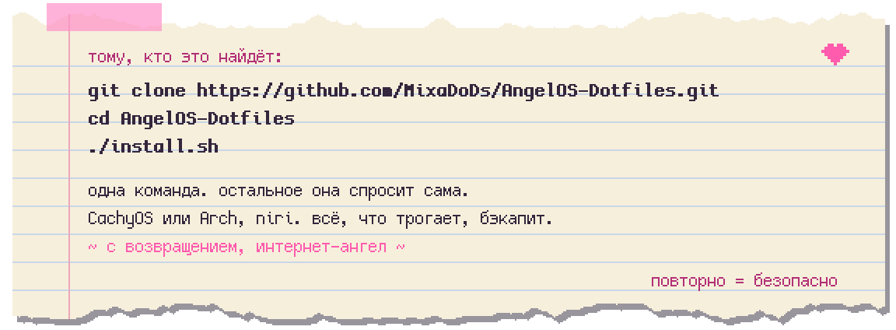

<div align="center">


# ♡ angelOS ♡

**`~ welcome back, internet angel ~ ● LIVE`**

Рабочий стол для **CachyOS / Arch** на **[niri](https://github.com/YaLTeR/niri)** со своей оболочкой на
[Quickshell](https://quickshell.org): снаружи NEEDY GIRL OVERDOSE, внутри Y2K, в углу ангел, а под обёрткой
история. Два облика. Игра, которую можно выключить. Обои, которые дышат.

-ff5cad?style=flat-square&labelColor=241432)


[English](README.md) · **Русский**

</div>

> [!NOTE]
> Все картинки здесь сняты на чистой установке во вложенной сессии niri с одноразовым домом: пользователь
> `angel`, ни чьих уведомлений и переписок. Во вложенной сессии niri использует `Alt` как `Mod`; на настоящем
> железе `Mod` — клавиша **Super / Windows** (⌘ в облике macOS), и в таблицах клавиш написано именно так.

---

*Дальше — то, что лежало в `~/Documents/diary.txt` на машине, где делались скриншоты. Кто это писал, никто не
помнит. Оставлено как было, картинки добавлены там, куда текст показывал.*

**Записи:** [01 установка](#-01--я-это-поставил) · [02 два облика](#-02--у-него-два-лица) ·
[03 обои](#-03--обои-живые) · [04 правая кнопка](#-04--я-нажал-правую-кнопку) ·
[05 настройки](#-05--здесь-настраивается-всё) · [06 стол](#-06--окна-на-ленте) ·
[07 macOS](#-07--goldengateapp) · [08 игра](#-08--в-углу-кто-то-есть) ·
[09 плагины](#-09--для-него-пишут-другие) · [10 обновления](#-10--оно-следит-за-собой) ·
[11 железо](#-11--работает-на-том-что-у-меня-есть) · [12 открыто](#-12--всё-здесь) · [клавиши](#-последние-страницы-клавиши)

---

## ✧ 01 · я это поставил

Адрес был на клочке бумаги. Три строки. Я набрал их в пятницу вечером.

<div align="center">

</div>

```bash
git clone https://github.com/MixaDoDs/AngelOS-Dotfiles.git
cd AngelOS-Dotfiles
./install.sh
```

Оно со мной разговаривало: пастельный стрим прямо в терминале, нарисованный
[gum](https://github.com/charmbracelet/gum), пиксельные рамки, меню, где галочки ставишь пробелом, прогресс-бар
из сердечек и чат, который комментирует происходящее. Девять вопросов, а дальше оно пошло само.


| Спросило | Что я ответил |
| --- | --- |
| Профиль | `full` (весь облик) или `tech` (только конфиг niri и утилиты) |
| Оболочка | angelOS (по умолчанию), Noctalia или ничего |
| Облик | **Pixel** или **macOS**, а для macOS — нужны ли ⌘-клавиши |
| Игра | angelOS как игра или просто дотфайлы (`ANGELOS_GAME=0\|1`) |
| Обои | паки из [PixelStreetArt_Wallpapers](https://github.com/MixaDoDs/PixelStreetArt_Wallpapers), качаются только отмеченные папки |
| fish | поставить с его видом и сделать оболочкой входа (`FISH_DEFAULT=0` оставит твою) |
| Программы | те, что на скриншотах: Helium, Telegram, Spotify, Obsidian, qView, mpv, LocalSend, Discord |
| Остальное | голосовой ввод (Voxtype + модель Whisper), экран входа SDDM, повседневные утилиты |
| Клавиатура | мои раскладки, какая активна после входа, чем переключать |

Всё, что заменял, сначала бэкапил (`имя.bak.ГГГГММДД-ЧЧММСС`), потом прогнал `niri validate` и сказал, что
дальше. Запускать повторно безопасно. Без терминала то же самое делает `INTERACTIVE=0` с ответами в переменных
окружения (`PROFILE`, `ANGELOS_THEME`, `MAC_KEYS`, `KB_LAYOUTS`, `INSTALL_APPS` и остальные перечислены в начале
`install.sh`).

Потом первый вход. Экран сказал, что доделывает установку, и минуту я верил. Что было в ту минуту, я записывать не
буду. Из-под края экрана что-то поднялось, потом заиграла милая мелодия, а потом мастер настройки, как будто
ничего не случилось: язык, откуда я пришёл (Windows, Mac, другой Linux, ниоткуда), игра или просто стол, какой
экран главный, раскладки, мышь, светлая или тёмная, обои, сколько всего должно двигаться. А затем пиксельные
кружки обошли экран и рассказали, что здесь что.


*(`angelos setup skip` из текстовой консоли отпускает стол сразу, если мастер вдруг застрянет. И мастер, и подсказки
можно повторить из Настройки → Учётная запись.)*

---

## ✧ 02 · у него два лица

Установщик спросил: **Pixel или macOS**. Я выбрал пиксельный. На следующий день попробовал второй, потому что
*Настройки → Оформление* переключает в любой момент, а всё, что облик менял вне оболочки (GTK, Qt, курсор, клавиши
niri), возвращается, когда из него выходишь.

| | **Pixel** (angelOS) | **macOS** (Golden Gate) |
| --- | --- | --- |
| Панель | таскбар Win98: столы-сердечки, кнопки окон, **строка лирики** посередине | строка меню: меню самого приложения, Пункт управления, Spotlight, дата |
| Программы | «Пуск» + лаунчер | **Dock** с увеличением, свёрнутые окна, «Загрузки» и «Корзина» |
| Окна | пиксельные рамки, углы 4 px, тонкая акцентная обводка | углы 16 px, тени, светофоры, **сворачивание в Dock** |
| Стекло | — | **Liquid Glass**: блюр niri под оболочкой, край-линза шейдером |
| Звуки | пак Y2K | системные звуки в духе Mac (свои, CC0) |
| Клавиши | angelOS (`Mod`+`Space`, `Mod`+`Q`…) | по желанию **⌘-клавиши**: ⌘Q ⌘W ⌘M ⌘Space ⌘Tab, тайлинг на `Super`+`Alt` |
| Шрифт, курсор | пиксельные шрифты и курсоры | Inter, курсор `macOS` |

 

*pixel.exe ✧ goldengate.app: в одном клике друг от друга.*

Пиксельный — тот, что поёт. Панель показывает текущую строку того, что играет (синхронная лирика с
[lrclib.net](https://lrclib.net) через MPRIS), печатает её как на стриме, старая строка уезжает вверх. Палитры:
`bubblegum`, `overdose`, `cyber angel`, Gruvbox, Rosé Pine, Catppuccin или цвета, вытянутые из обоев.


---

## ✧ 03 · обои живые

Картинка остаётся картинкой; оболочка смотрит на неё, находит небо, воду, облака, то, что висит в небе, и
двигает только это: ночью мерцают и падают звёзды, вода идёт рябью и отражает, облака плывут, время от времени по
кольцу пробегает блик или с обрыва срывается камешек. Под полноэкранным окном всё замирает, стоит это почти ничего.
*Настройки → Обои → Живые обои* включает и выключает слои по одному.


Рядом с картинкой может лежать подсказка (`картинка.scene.json`: где небо, где вода, где кольцо), и релизные обои
идут со своими. Картинки без подсказки получают автоматический разбор.

У каждого релиза свои обои, нарисованные для него, MIT как и всё остальное, каждые в дневной и ночной версии.
Оболочка выбирает день или ночь под тему и форму под монитор: 16:9, 21:9 или 9:16, если экран стоит боком.
Установщик кладёт их все в `~/Pictures/AngelOS/`.

<div align="center">


</div>

Смена обоев играет пиксельный переход (мозаика + дизер Байера), и только когда меняется картинка, поэтому
переключение столов остаётся мгновенным даже с обоями на каждый стол. `Mod`+`Shift`+`Return` открывает выбор:
одна картинка на все экраны, своя на монитор или своя на стол.


---

## ✧ 04 · я нажал правую кнопку

У стола есть меню. Вообще-то **шесть** меню, и какое из них ты получишь, выбираешь сам: обычный список как в
Windows 11, кольцо вокруг курсора, глянцевый пузырь Y2K, плитки Пункта управления, крылья, арфа. (Есть и седьмое.
Оно не на этом этаже.)


Как бы оно ни выглядело, внутри одно и то же: быстрые действия сверху, **Вид ▸** (виджеты, режим правки, сетка),
**Создать ▸** (заметка, скриншот, запись), **Открыть ▸** (твои папки), параметры экрана, персонализация, *Открыть в
терминале* и **Показать больше ▸** для всего, что добавили плагины. Что в нём, в каком порядке и свои пункты:
*Настройки → Меню правой кнопки*.


Виджеты (`clock.exe`, `sysmon.exe` с CPU/GPU/RAM/VRAM/сетью, `cava.exe`, `music.exe` и свои у плагинов) лежат на
обоях, таскаются за заголовок; двойной клик по заголовку — режим правки. Пиксельное окно вокруг, плашка или ничего,
на выбор.

---

## ✧ 05 · здесь настраивается всё

Я всё находил и находил. Записываю, чтобы перестать удивляться:

- **Панель** бывает шести форм (таскбар, верхняя, остров, док, капсулы, «windose») и сидит на любом краю экрана.
  Её состав собирается перетаскиванием.
- **Сами Настройки** с четырьмя лицами: Windows 11, боковая панель macOS, Панель управления Win98, вкладки
  «Свойства» (`angelos settingsView …`). Поиск с синонимами и историей.
- **Alt+Tab** в трёх стилях (angelOS, NGO, Y2K) или родной niri с живыми превью.
- **Переключение столов** в тринадцати анимациях: soft, dash, spring, snap, zoom, card, wipe, fade, dissolve,
  glitch, CRT, realm, instant. К ним NGO-попап `workspace_N.exe` и полоска сердечек.
- **Экран входа** (SDDM) в пяти обликах с живым предпросмотром и теми же обоями, что на столе. **Экран
  блокировки** в двух: NGO-стрим с чатом или врата рая.
- **fastfetch** в семи стилях (compact, angel, helper, receipt, stream, window, mini), у каждого свой знак.
- **Шрифты** пресетами, пиксельные и нет. **Курсоры** пиксельные или `macOS`. **Звуки** паками (Y2K, Overdose,
  macOS), на каждое событие или ни на одно, под музыкой.
- **Окна:** пресеты ширины, ширина на приложение, где открываются новые, паутина, которая нарастает на окне,
  к которому часами не прикасались.
- **Экран:** тащи мониторы по схеме; точные частоты из списка niri, поворот, масштаб, и всё это переживает
  перезагрузку.
- Каждое изменение конфига niri бэкапится, проверяется `niri validate` и откатывается, если niri против. Браузеры
  тоже следуют теме (Helium и Chromium через GTK, Firefox через `userChrome.css`).


---

## ✧ 06 · окна на ленте

niri. Окна живут колонками на бесконечной горизонтальной ленте: новые открываются справа, фокус прокручивает вид,
колонки меняют ширину, центрируются, складываются, превращаются во вкладки или выпадают плавающими окнами.
`Mod`+`Tab` отъезжает ко всем столам сразу. Думал, что возненавижу. Нет.


`Mod`+`Space` — лаунчер: нечёткий поиск программ, который запоминает, что я открываю, `web …` для веба и моих сайтов,
`plugins …` для каталога, `claude …` для Claude Code, `> команда` для чего угодно в `sh`.


Забыл клавишу? `Mod`+`Shift`+`Esc` показывает подсказку niri; у каждого бинда человеческое название.


Терминал тоже пришёл одетым: **fish** с промтом pure, fastfetch с логотипом angelOS вместо приветствия, eza, fzf,
done, autopair (на CachyOS это `cachyos-fish-config`; на Arch то же самое ставится из `packages/fish.txt` и
fisher). **kitty**, **foot** и **Alacritty** в палитре, **btop** и **fastfetch** тоже. **Neovim** с
[LazyVim](https://lazyvim.github.io) встаёт только туда, где `~/.config/nvim` пуст; твой конфиг не трогается.
`n` открывает его; `angelos …` лежит в `PATH`.

Мелкие утилиты в `~/.local/bin`, простой Bash и Python: `niri-screenshot-region` (область с пиксельными «верёвками
гравитации»), `niri-record-region` (запись области в `~/Videos`, переключатель), `niri-ocr` (текст из области в
буфер, любой установленный язык Tesseract), `niri-cast-privacy` (чаты и менеджеры паролей чернеют на стриме),
`niri-game-mode` (без анимаций, блюра и стекла, пока игра закрывает экран), `polkit-agent-guard` (диалог пароля
приходит всегда), `voxtype-indicator` (диктовка).

---

## ✧ 07 · goldengate.app

Второе лицо. Весь стол как macOS 27 *Golden Gate*, срисованный со скриншотов и гайдлайнов Apple, а не по памяти, и
без единого файла Apple. Выбирается в установщике, в мастере (*«Пришёл с Mac?»*), в Настройки → Оформление или
командой `angelos settingsSkin goldengate`.


- **Строка меню.** 24 pt сверху каждого экрана. Слева эмблема angelOS (Об этом компьютере, Настройки, Завершить
  принудительно, Сон, Перезагрузка, Выключение, Блокировка, Выход), имя программы жирным и **её собственные
  меню**: Qt через dbusmenu, GTK 3 через `appmenu-gtk-module`, действия GtkApplication, а для остальных стандартный
  набор из их же шорткатов. В меню нет мёртвых пунктов. Справа звук, раскладка, Wi-Fi и Bluetooth, когда они есть,
  трей, Spotlight, **Пункт управления** и дата. `Ctrl`+`F2` ходит по меню с клавиатуры.
- **Dock.** Плита Liquid Glass: закреплённые программы, *Программы*, недавние после разделителя, **свёрнутые
  окна**, «Загрузки» и «Корзина». Точка под запущенными, меню по правой кнопке с окнами и действиями из `.desktop`,
  **увеличение** как на Mac (иконка под указателем растёт, соседи по косинусу, Dock расширяется в обе стороны,
  чтобы иконка осталась под курсором), автоскрытие. Иконки из
  [MacTahoe](https://github.com/vinceliuice/MacTahoe-icon-theme) (GPL-3.0, закреплённый релиз, проверка sha256).
- **Сворачивание.** В niri его нет, запрос выбрасывается. angelOS делает сам: окно уходит на скрытый стол, а его
  **снимок ложится справа в Dock**. Жёлтый светофор, *Окно → Свернуть*, `⌘M` или `angelos macMinimize`; назад
  кликом по снимку, по иконке, в Alt+Tab или в обзоре.
- **Spotlight** (`⌘Space`): тёмная стеклянная капсула для программ, файлов, действий и буфера. **Пункт
  управления** в раскладке macOS: Wi-Fi, Bluetooth, *Сейчас играет*, запись экрана, Mission Control, блокировка,
  тёмная тема, скриншот, «Не беспокоить», ползунки экрана и звука. Дата открывает **Центр уведомлений**.
- **Liquid Glass** — три слоя: блюр и насыщенность niri 26.04 под стеклом (окна тоже), тон от прозрачного до
  цветного и край-линза (тёмный ободок, блик сильнее к свету, тонкая полоска «собранного» света с лёгким
  расщеплением цвета), нарисованный [`shaders/liquid_glass.frag`](.config/quickshell/angelos/shaders/liquid_glass.frag).
  *Уменьшить прозрачность* делает его сплошным.
- **Звуки:** уведомление, ошибка, «поп» громкости, затвор, очистка Корзины, USB туда и обратно, зарядка,
  блокировка, вход. Все свои, синтезированы `scripts/mac-sounds.py`, CC0. Положи файлы с теми же именами в
  `~/.local/share/angelos/sounds/macos/`, и будут твои.


**Что здесь не от Apple:** в репозитории нет ни одного файла Apple. Эмблема angelOS вместо яблока, **Inter**
(SIL OFL) вместо SF Pro, иконки Lucide, иконки Dock MacTahoe (GPL-3.0), курсор `macOS` из
[ful1e5/apple_cursor](https://github.com/ful1e5/apple_cursor) (GPL-3.0), синтезированные звуки, нарисованные обои.
MacTahoe, Inter и курсор скачиваются при первом включении облика под своими лицензиями.

---

## ✧ 08 · в углу кто-то есть

Она была там с первого входа, справа внизу, сидит на панели. Разговаривает. Нечасто и не ни о чём. Заметила, когда я
открыл шесть окон подряд. Заметила, когда я просидел за экраном четыре часа. Есть достижения, и сундуки, и её
дневник с ключом, который пришлось заслужить, и она очень против, когда его читают при ней.


Звуки — Y2K: диск раскручивается при загрузке, звон, голоса в духе Undertale для её реплик. Экран блокировки может
быть NGO-стримом с чатом, который тебе отвечает. Есть режим для стримеров, где она сидит в кадре и читает чат. У
всего, что вспыхивает, трясётся и становится громким, есть переключатель *спокойно*.

Что я знаю точно, потому что прочитал код: **может напугать, но вреда не причинит.** Не трогает файлы, никуда
ничего не шлёт, не читает окна, браузер и переписки. Экран блокировки, меню питания, громкость, уведомления и
polkit работают всегда, что бы ни происходило. А ещё у этого места есть нижний этаж, который я описывать не стану,
кроме того, что Dock и строка меню тоже о нём знают.

- **Выход сразу, в любой момент:** `angelos game off` или **`Mod`+`Ctrl`+`Shift`+`Esc`**. angelOS остаётся обычными
  дотфайлами, ангела нет, меню правой кнопки теряет седьмой облик. `angelos game on` возвращает всё. Установщик и
  мастер спрашивают заранее.
- **Движение:** `angelos motion full|calm|off`. *Calm* — без вспышек, тряски и резких громких звуков. *Off* — без
  анимаций вообще.
- **Прогресс** живёт в `~/.config/angelos/save.json`. Обновления его не трогают.

---

## ✧ 09 · для него пишут другие

Плагин — папка с `manifest.json`. Он может добавить пункты в меню правой кнопки, виджеты на панель и на стол,
провайдеры лаунчера, страницу настроек и фоновый сервис. Гайд:
[`docs/PLUGINS.md`](.config/quickshell/angelos/docs/PLUGINS.md).

- **Community Plugins:** один каталог в *Настройки → Плагины* (и `plugins …` в лаунчере): одобренные записи
  [реестра сообщества angelOS](https://github.com/futureUnd1ground/angelos-community-registry) рядом с тем, что у
  тебя стоит, с установкой, обновлением и **откатом**. Обновления проверяются раз в день; перед каждым установленная
  копия становится снимком, и плагин, который не загрузился, сам к нему возвращается.
- **Plugin Studio:** с включённым *режимом разработчика* опиши плагин, ответь на его вопросы, и Studio напишет
  QML в теме с твоим ключом OpenAI или Anthropic, покажет файлы и проверит их до установки
  ([гайд](.config/quickshell/angelos/docs/PLUGIN_STUDIO.md)).

| Встроенные | Что делают |
| --- | --- |
| `cat` | Пиксельный кот на панели: спит, гуляет или бежит вместе с нагрузкой CPU |
| `speedtest` | Тест скорости интернета с пиксельным спидометром и историей |
| `web-search` | `web …` в лаунчере: поисковики и любимые сайты |
| `claude-companion` | Что осталось от плана Claude, живые сессии Claude Code, `claude …` в лаунчере |
| `codex-companion` | То же для OpenAI Codex: окна на 5 часов и неделю, токены за сегодня, живые сессии |
| `osu-mini` | Мини-игра в духе osu! под бит: пиксельные сердечки, комбо, ранги (`osu` в лаунчере) |
| `nightlight` | Тёплый экран вечером через `wlsunset` |
| `stream-stats` | `stats.exe` как в NGO: stress = CPU, darkness = RAM, love = аптайм |
| `quick-actions` | Дополнительные пункты в меню правой кнопки |


---

## ✧ 10 · оно следит за собой

**Обновления.** *Настройки → Обновления* проверяет репозиторий, из которого я ставился, показывает, что нового, и
по клику делает `git pull` и прогоняет установщик без пакетов. Прежде чем что-то изменится, каждый файл, который
установщик может записать, копируется в `~/.local/state/angelos/backups/<дата>-update/`. Обновление засчитывается,
только если прошли установщик, проводка niri и `niri validate`; иначе страница предлагает **Вернуть состояние до
обновления**. Запущенный angelOS спрашивает, перезапуститься сейчас или позже; окна остаются. Из терминала:
`git pull && ./install.sh`.


Основа — настройка автора, моё сверху. Конфиг, который я не трогал, идёт за автором при каждом обновлении; тот,
что менял, получает правки автора слиянием, а где мы оба поменяли одни и те же строки, остаются мои (старый файл
рядом как `*.bak.<дата>`). Шорткаты сливаются клавиша за клавишей. Файлы, которые angelOS генерирует, остаются моими,
их новые версии ждут в `~/.local/state/angelos/kept-updates/`. Свои строки — в `~/.config/fish/user.fish` и
`~/.config/niri/cfg/user.kdl`, читаются последними, никогда не трогаются. После обновления оно предлагает программы,
которые автор добавил в группы, что я брал, и само ничего не ставит и не удаляет.

**Репорты.** Когда что-то ломается, *Настройки → О системе → Сообщить о проблеме* (или `angelos report`) собирает один
архив: версии (angelOS, Quickshell, Qt, niri, ядро, GPU), состояние сервиса оболочки и перезапуски, сколько она
стоит, лог, последние крэш-репорты, проверка конфига niri, плагины и настройки, с вырезанным личным (путь дома и
имя пользователя становятся `~` и `<user>`; история лаунчера, имена столов и свободные тексты не попадают).
Никуда ничего не отправляется. Архив ложится в `~/` со ссылкой на новый issue, а что прикладывать, решаю я.


Сторожок перезапускает оболочку, если она не отвечает пятнадцать секунд, и сохраняет крэш-репорт. Экран входа
держит бэкап прежней темы. Установщик никогда не перезаписывает `monitor.kdl`.

---

## ✧ 11 · работает на том, что у меня есть

- **CachyOS или Arch Linux.** Установщик добавляет только репозиторий `[cachyos]`, где его нет; пакеты Arch в
  приоритете. Драйверный вопрос Steam больше не тянет ничего экзотического.
- **GPU:** NVIDIA и AMD. Системный монитор читает обе. Qt-фиксы для NVIDIA уже внутри.
- **Ноутбуки:** батарея и предел заряда, эко-режим, клавиши яркости и подсветки клавиатуры, направление прокрутки и
  ускорение тачпада, всё в мастере и в Настройках, и показывается только на ноутбуке.
- **Мониторы:** сколько угодно, любая частота (точно та, что в списке niri, и сохранённая так, что 144 Гц остаются
  144 Гц после перезагрузки), масштаб, поворот, вертикальные экраны с обоями 9:16, ультраширокие с 21:9. Называются
  по *производитель модель серийник*, так что переименованный разъём всё равно совпадёт.
- **Клавиатуры:** любые раскладки, своё сочетание переключения, и они же выбирают язык диктовки и пакеты OCR.
  ⌘-клавиши для тех, кто с Mac, кнопки окон GTK для тех, кто с Windows.
- **Языки:** английский и русский в установщике, мастере, оболочке и у ангела.
- **Браузеры:** Helium, Firefox, Chromium, Brave, Zen, LibreWolf, Vivaldi или Chrome; мастер спрашивает,
  `Mod`+`B` открывает выбранный.
- **Доступность:** размер интерфейса, движение, контраст, лупа (`Mod`+`Alt`+`=`), голосовая диктовка, «потряси
  мышь, чтобы найти курсор». **Благополучие:** экранное время, перерывы, вода; напоминает она.
- **Геймпады:** оболочка знает твой контроллер, его кнопки и оси.
- **Стрим:** режим стрима, который видит OBS, `niri-cast-privacy` для чатов и менеджеров паролей, игровой режим,
  снимающий эффекты, пока игра закрывает экран.

---

## ✧ 12 · всё здесь

MIT, целиком: дотфайлы, оболочка, обои, см. [`LICENSE`](LICENSE), © 2026 MixaDoDs. Чужие части остаются под своими
лицензиями, список в [`THIRD-PARTY.md`](THIRD-PARTY.md). В репозитории нет ключей, токенов, профилей браузеров,
cookies, истории, кэшей, keyring и состояния сессии, а `scripts/check.sh` падает, если что-то такое проскочит. Твои
настройки angelOS (`~/.config/angelos`) — твои.

```text
.config/quickshell/angelos/  angelOS: оболочка, оба облика, плагины, шаблоны, документация
.config/niri/                niri: конфиг, профили клавиш (common / pixel / macos), правила, анимации
.config/                     fish, kitty, foot, Alacritty, GTK, btop, fastfetch, Neovim, Noctalia, Voxtype
.local/bin/                  утилиты
.local/share/                тема иконок pixora и пиксельные шрифты
Pictures/AngelOS/            обои каждого релиза с подсказками сцен
packages/                    pacman.txt, angelos.txt, sddm.txt, tools.txt, fish.txt, nvim.txt (программы: data/apps-catalog.json)
installer/tui.sh             лицо установщика: меню gum, пиксельные рамки, сердечки, чат стрима
install.sh                   установщик: спрашивает всё, бэкапит, только Arch Linux / CachyOS
scripts/check.sh             проверка репозитория со сквозными тестами установщика
scripts/demo/                стенд, в котором сняты картинки этой страницы
docs/                        скриншоты и GIF этой страницы
```

`scripts/check.sh` прогоняет всю проверку локально (ту же, что GitHub, в контейнере `archlinux` через
`scripts/ci-local.sh`). Issue и pull request приветствуются; `angelos report` — хорошее первое вложение.

---

## ✧ последние страницы: клавиши

У каждого облика свой профиль клавиш: [`keybinds.kdl`](.config/niri/cfg/keybinds.kdl) только выбирает один,
[`keybinds-common.kdl`](.config/niri/cfg/keybinds-common.kdl) (оба облика) плюс
[`keybinds-pixel.kdl`](.config/niri/cfg/keybinds-pixel.kdl) или [`keybinds-macos.kdl`](.config/niri/cfg/keybinds-macos.kdl).
Настройки → Клавиатура правят тот, что сейчас впереди.

<details>
<summary><b>Оба облика</b></summary>

| Клавиши | Действие |
| --- | --- |
| `Mod`+`T` | Терминал (kitty) |
| `Mod`+`B` | Браузер по умолчанию |
| `Mod`+`E` | Файлы (Nautilus) |
| `Mod`+`V` | История буфера обмена |
| `Mod`+`S` / `Mod`+`Alt`+`S` | Настройки |
| `Mod`+`Shift`+`Return` | Выбор обоев |
| `Mod`+`Shift`+`Q` | Меню питания |
| `Mod`+`Alt`+`T` / `Mod`+`Alt`+`Y` | Светлая ⇄ тёмная / лирика вкл-выкл |
| `Mod`+`Shift`+`S` | Скриншот области («верёвки гравитации») |
| `Mod`+`Shift`+`R` | Запись области (переключатель) |
| `Mod`+`Shift`+`V` | Голосовая диктовка (переключатель) |
| `Mod`+`Shift`+`X` | Приватность трансляции: чаты и менеджеры паролей чернеют на стриме |
| `Ctrl`+`Shift`+`2` / `3` | Скриншот экрана / окна |
| `Mod`+`Shift`+`←→↑↓` | Фокус на другой монитор (`+Ctrl`: перенести туда колонку) |
| `Mod`+`Shift`+`P` | Выключить мониторы |
| `Alt`+`Tab` | Переключатель окон angelOS |
| `Mod`+`Alt`+`=` / `-` / `0` | Лупа: ближе / дальше / закрыть |
| `Mod`+`Esc` | Отпустить захват клавиатуры полноэкранной программой |
| `Mod`+`Ctrl`+`Shift`+`Esc` | Выйти из игры сразу |
| `Ctrl`+`Alt`+`Delete` | Выйти из niri |

Медиа-клавиши и громкость идут в `angelos …` (маленький OSD показывает уровень) и работают на экране блокировки.

</details>

<details>
<summary><b>Pixel</b></summary>

| Клавиши | Действие |
| --- | --- |
| `Mod`+`Space` | Лаунчер |
| `Mod`+`Q` | Закрыть окно |
| `Mod`+`Alt`+`L` | Заблокировать экран |
| `Mod`+`H` / `Mod`+`L` (или стрелки) | Фокус на колонку слева / справа (`+Ctrl`: перенести её) |
| `Mod`+`J` / `Mod`+`K` | Фокус на окно ниже / выше |
| `Mod`+`1`…`9` / `Mod`+`Ctrl`+`1`…`9` | На стол / перенести туда колонку |
| `Mod`+`O` | Предыдущий стол |
| `Mod`+`Tab` | Обзор |
| `Mod`+`R` / `Mod`+`Alt`+`R` | Следующая / предыдущая ширина колонки |
| `Mod`+`C` | Колонку в центр |
| `Mod`+`[` / `Mod`+`]` | Втянуть окно в соседнюю колонку или вытолкнуть |
| `Mod`+`W` | Колонка вкладками |
| `Mod`+`Shift`+`Space` | Плавающее ⇄ в сетке |
| `Mod`+`F` / `Mod`+`Shift`+`F` / `Mod`+`M` | Полный экран / развернуть колонку / развернуть до краёв |
| `Mod`+`-` / `Mod`+`=` | Колонка уже / шире |
| `Mod`+`Shift`+`T` | OCR области в буфер |

</details>

<details>
<summary><b>macOS (⌘ = Super)</b></summary>

⌘-клавиши по желанию: установщик спрашивает (`MAC_KEYS=1|0`), а *Настройки → Оформление →
Golden Gate* включают и выключают их. Без них облик macOS оставляет пиксельные клавиши.

| Клавиши | Действие |
| --- | --- |
| `⌘Space` | Spotlight |
| `⌘Q` | Выйти из программы впереди (её собственный *Выход*, иначе все её окна) |
| `⌘W` | Закрыть окно |
| `⌘M` | Свернуть в Dock |
| `⌘H` | Скрыть программу |
| `⌘Tab` / `⌘⇧Tab` | Переключить программу |
| `` ⌘` `` | Следующее окно той же программы |
| `⌘,` | Системные настройки |
| `⌘⇧3` / `⌘⇧4` / `⌘⇧5` | Скриншот: экран / область / меню скриншота |
| `⌃⌘F` | Полный экран |
| `⌃⌘Q` | Заблокировать экран |
| `⌥⌘Esc` | Завершить принудительно |
| `⌃←` / `⌃→` | Стол слева / справа |
| `⌃↑`, `F3` | Mission Control (обзор) |
| `⌃F2` | Строка меню с клавиатуры |
| `⌘⌥Space` | Лаунчер angelOS |
| `⌘⌥` + `H J K L` / стрелки, `1`…`9`, `R`, `C`, `F`, `W` | Тайлинг: пиксельные клавиши на один `Alt` дальше |

Внутри программ их собственные сочетания остаются своими (`Ctrl`+`C`, `Ctrl`+`V`), и в меню они подписаны так же.

</details>

<details>
<summary><b>Экран входа (SDDM), если капризничает</b></summary>

| Симптом | Что делать |
| --- | --- |
| Загружается в текстовую консоль | `sudo systemctl enable --force sddm && sudo systemctl set-default graphical.target` |
| `display-manager.service already exists` | отключить другой (`gdm`, `lightdm`, `ly@tty2`, `greetd`), потом включить SDDM |
| Обычный SDDM вместо темы angelOS | `grep -r Current= /etc/sddm.conf /etc/sddm.conf.d/`; поставить `qt6-declarative` |
| Нет обоев | выбрать обои в angelOS и проверить `/usr/share/sddm/themes/angelos/walls/` |

Посмотреть тему, не выходя из сессии: `sddm-greeter-qt6 --test-mode --theme /usr/share/sddm/themes/angelos`.

</details>

---

<div align="center">

*последняя запись. она передаёт привет.*

`♡ thank you for watching the stream ♡`

</div>
